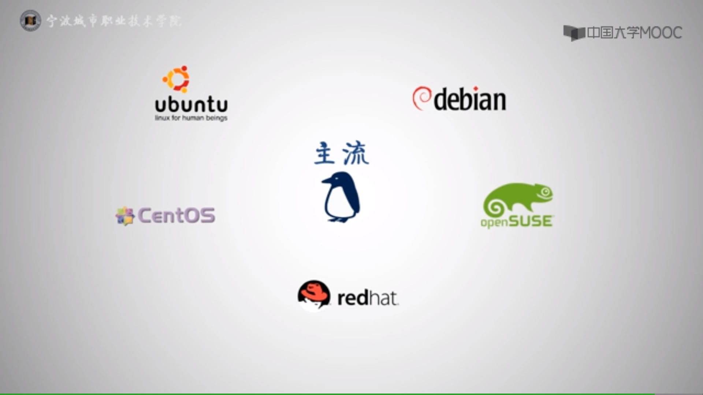

## 一）开始

### 名词解释

- **大小写敏感**: 即区分大小写。Linux 中的命令和脚本是区分大小写的，文件的名称也是区分大小写的。
- **shell**: 原意壳，包裹在操作系统内核之外，是一种用于解释执行 `shell` 脚本的工具。Linux 中的 shell 有很多种，比如 sh（Bourne shell）、bash（Bourne Again shell）、dash（Debian Almquist shell）、zsh 等。shell 命令对大小写敏感。
- **bash**: Linux 默认的 shell，在 Linux 上 sh 一般是 bash 的软连接。但 ubuntu 等 debain 系列的 Linux 上，sh 默认指向 dash。

### Linux 操作系统

<table>
    <tr>
        <td><strong>冷知识</strong></td>
        <td>你知道三大操作系统是哪三个吗？</td>
    </tr>
</table>

三大操作系统分别是：Windows、Linux、Unix。

目前世界上的操作系统除了 Windows，基本上都是基于 Linux 或 Unix 系统进行开发的。Mac OS 就是基于 Unix 的一个分支进行开发的，而 Android 是基于 Linux 进行开发的。其中 Unix 最早诞生，而 Linux 的诞生又与 Unix 有关，同时因为 Linux 与 Unix 十分相似，所以大家又把 Linux 称为「类 Unix 操作系统」。



Linux 操作系统按照用途，分为两大类。一种是用于个人电脑，一种是用于服务器的。用于个人电脑的通常是有用户界面的，因为这样学习成本低，对个人用户来说效用更高。用于服务器的通常不安装用户界面，只能通过命令行与操作系统交互，因为没有用户界面可以进一步降低企业服务器的运行成本，对企业来说，效用更高。

ubuntu 是通常用于个人电脑的 Linux 操作系统。属于 debian 系。

redhat 是主要面向企业的收费 Linux 操作系统。

Cent OS 是 redhat 的社区版，免费。所以通常各个公司都会选择使用 Cent OS 用作服务器的操作系统。这里我们也选择 Cent OS 进行学习。

如果大家有兴趣，也可以自己给电脑安装个 Linux，形成双系统。Deepin OS 推荐可以试试。最新推出的国产操作系统「统信 UOS」也可以尝尝鲜。

#### 下载安装

**下载**：[centos](https://www.centos.org/download/) 

**安装**：https://www.cnblogs.com/frankdeng/p/9027037.html

<table>
    <tr>
        <td><strong>注意</strong></td>
        <td>对于初学者，在软件选择时，不要选择“最小化安装”（Minimal Install），而是选择“GNOME桌面”</td>
    </tr>
</table>

### Linux 命令基础

#### 关于命令输入前的字符串的解读

```
[root@localhost ~]#
```

- `@` 符号之前表示用户名，之后表示 `hostname`
- `~` 表示当前目录，默认为 `~` ，表示家目录
- 最后的 `$` 表示普通用户，`#` 表示管理员用户


#### `whoami` 命令

默认输出用户名

| 参数        | 说明       |
| ----------- | ---------- |
| `--version` | 输出版本号 |
| `--help`    | 输出帮助   |

#### `who` 命令

`who am i` 输出用户名及伪终端编号和时间（应该是打开时间）

**`who` 命令其它常用参数**

| 参数 | 说明                       |
| ---- | -------------------------- |
| `-a` | 打印能打印的全部           |
| `-d` | 打印死掉的进程             |
| `-m` | 同`am i`,`mom likes`       |
| `-q` | 打印当前登录用户数及用户名 |
| `-u` | 打印当前登录用户登录信息   |
| `-r` | 打印运行等级               |

#### `echo` 命令

* `echo` 回显 echo 后的字符（忽略英文单/双引号）
* `echo -n` 表示显示后不换行
* `echo -e` 表示执行单引号包裹的以 `\` 开头的转义字符（反斜杠）

#### `nano` - 编辑器，有自己的界面

* `Ctrl + o` 填入文件名，保存
* `Ctrl + g` 帮助文档
* `Ctrl + x` 返回（连按两次退出nano界面）

### 技巧与帮助

#### 使用技巧

* 自动补全：输入任意字符，按Tab自动补全输入命令。（当输入的字符不能唯一确定是某个命令时无效）
* 列出提示：输入任意字符，连按两次Tab，提示以输入字符开头的所有命令
* 命令帮助：不了解的命令可通过 `命令 --help` 查看命令帮助。

#### `man` - 帮助文档命令

[^man]: manual 的简写，手册、指南的意思。

##### 指令示例

* `man who` 进入 who 命令帮助文档界面
* `man 1 ls`  显示第一区段中的`ls`命令 man 页面。
* `man 1 read` 表示读取手册第一部分的命令。man 后面不添加数字默认从最小的分区进行读取。

##### 使用技巧

* 上下箭头允许将内容上下滚动

* page up 和 page down 允许翻页
* `/` 加字符串表示从光标处向下查找（斜杠）
  * `n`跳转到下一个匹配处
  * `N`跳转至上一个匹配处
* `q` 退出 man

##### 关于系统手册 - 共分为9大部分

1. 可运行的指令或可执行文件的帮助文档
2. 系统核心可使用的函数与工具等的帮助文档
3. 一些常用函数与库的帮助文档
4. 设备文件的说明
5. 配置文件或是某些文件的格式说明
6. 游戏程序的帮助文档
7. 惯例与协议，如文件系统、网络协议等的说明
8. 系统管理员可用的管理命令的帮助文档
9. 跟系统核心有关的文件的帮助文档

<table>
    <tr>
        <td><strong>注意</strong></td>
        <td>9个部分可能存在同名的命令</td>
    </tr>
</table>

#### 命令行常用快捷键

| 按键            | 作用                                         |
| --------------- | -------------------------------------------- |
| `Ctrl+c`        | 终止当前命令                                 |
| `Ctrl+d`        | 键盘输入结束或退出终端                       |
| `Ctrl+s`        | 暂停当前程序，暂停后按下任意键恢复运行       |
| `Ctrl+z`        | 将当前程序放到后台运行，恢复到前台为命令`fg` |
| `Ctrl+a`        | 将光标移至输入行头，相当于`Home`键           |
| `Ctrl+e`        | 将光标移至输入行末，相当于`End`键            |
| `Ctrl+k`        | 删除从光标所在位置到行末                     |
| `Alt+Backspace` | 向前删除一个单词                             |
| `Shift+PgUp`    | 将终端显示向上滚动                           |
| `Shift+PgDn`    | 将终端显示向下滚动                           |

### 关机和重启

#### Linux系统管理员关机三步走

关机是危险操作，所以Linux系统管理员关机时需要十分谨慎，一般分为以下三步：

* 查看在线用户和在线服务
* 通知用户关机/重启原因和时间安排
* 下达关机或者重启命令

#### `shutdown` - 关机或重启命令（仅根用户可用）

> 摘自：https://www.cnblogs.com/endv/p/6622452.html

　**Linux 关机命令**

- `shutdown -h now` 立刻关机（需要root权限）
- `shutdown -h 10` 10分钟后自动关机（需要root权限）
- `shutdown -h 00:00` 午夜00:00自动关机（需要root权限）
- `shutdown -h 10 系统即将关机，请注意保存` “系统即将关闭...”字样会发给每个终端（需要root权限）

　　如果是通过shutdown命令设置关机的话，可以用`shutdown -c`命令取消重启。使用 shutdown -c 需要 root 权限。

**Linux 重启命令**

- `shutdown -r now` 立刻重启（需要root权限）
- `shutdown -r 10` 过10分钟自动重启（需要root权限）
- `shutdown -r 20:35` 在时间为20:35时候重启（需要root权限）

　　如果是通过shutdown命令设置重启的话，可以用`shutdown -c`命取消重启。使用 shutdown -c 需要 root 权限。（跳转到[获取管理员权限](#用户权限)）

#### 其他关机/重启命令

除了使用 `shutdown` 命令还可以使用以下命令关机或重启

- `halt` 立刻关机（该命令使用后需要手动关闭电源）
- `poweroff` 立刻关机（相当于 halt + 切断电源指令。多用户方式下(Runlevel 3)不建议使用）
- `reboot` 立即重启（相当于 `shutdown -r now`，但不安全）