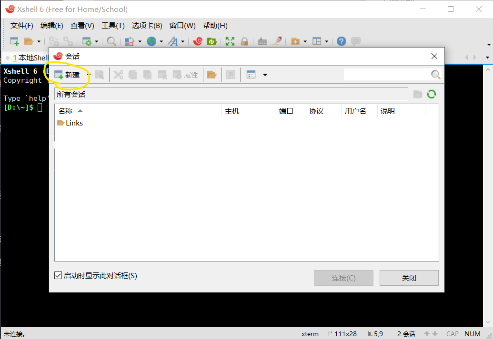

## 远程维护

<table>
    <tr><td><strong>广告：在此之前，你可能需要一台自己的远程服务器（每月 8 块多）</strong></td></tr>
</table>
<a href="https://curl.qcloud.com/iTI9549b"></a>

### 远程软件

**远程连接软件**

常用的远程连接软件有 Xshell、SecureCRT、putty 等。

**远程文件传输软件**

常用的远程文件传输软件有 Xftp（一般与 Xshell 组合使用）、WinSCP 等。

**下载上述软件**

```
链接：https://pan.baidu.com/s/17_-Oi_bmAhD7zYufl_stYQ 
提取码：vamj 
复制这段内容后打开百度网盘手机App，操作更方便哦
```

### 远程登陆

通常我们使用 `ssh` 协议进行远程登陆服务器。Linux 上 `sshd` 为我们提供了远程登陆的能力，因此我们能够远程登录服务器，需要运行该守护进程。通常情况下 `sshd` 默认开机启动，并监听 `22` 端口。所以我们远程登陆时连接 22 端口，可以直接使用远程工具登陆服务器。

这里仅介绍 Xshell 这一种远程连接软件连接服务器的方式，其他软件大致相同。

#### 使用 Xshell 远程登陆

【步骤一】：打开 Xshell，点击下图所示会话窗的新建按钮。



如果没有上图的会话框，也可以点击如下图所示的左上角的小窗。


【步骤二】：填写会话名称和主机地址


【步骤三】：点击左侧「用户身份验证」，填写用户名密码，然后点击下方的连接按钮。如果提示需要保存密钥，选择「接收并保存」。


#### 使用命令远程登陆

除了使用远程连接软件登录，你也可以使用任意一款命令行软件登陆。只要你的电脑支持 ssh 命令。

**语法**

```bash
ssh [user@]host[:port]
# 或使用如下方式
ssh [user@]host [port]
```

**解释**

- `user` 为登陆用户名，一般为 root。
- `host` 为登陆 IP，一般为公网可访问的 IP 地址。
- `port` 为远程的端口，默认为 22，可以省略不写。如果远程端口设置为其他端口号，则需要填写该选项

#### 不能远程连接服务器的情况

首先确认远程的 IP、用户名、密码等是否正确。

查看服务器是否启用 `sshd` 守护进程。

```bash
systemctl status sshd  # centos 6 请使用 service 命令
```

如果 `sshd` 守护进程未启动，使用如下命令启动；否则跳过此步骤。

```bash
systemctl start sshd
```

如仍不能连接，使用如下命令查看是否启动 22 端口：

```bash
firewall-cmd --list-ports
```

如未启用，使用如下命令开放 22 端口：

```bash
firewall-cmd --zone=public --add-port=22/tcp --permanent
```

```bash
firewall-cmd --reload  # 或 service firewall-cmd restart
```

### 远程文件传输

除了使用远程文件传输软件，也可以使用一些远程文件传输的命令行工具进行文件传输。比如 `lrzsz`、`scp`。

#### `lrzsz` 工具

如果你使用的是 xshell 或 SecureCRT 等支持 zmodem/xmodem/ymodem 的远程工具，可以使用 `rz`、`sz` 命令进行文件传输，非常方便。你甚至可以通过拖动文件到命令行的方式发送文件到远程服务器。但使用 `rz`、`sz` 前需要先安装 `lrzsz`。

**安装**

查看是否安装 `lrzsz`，显示如下所示则表示已安装

```bash
> yum list installed | grep lrzsz
lrzsz.x86_64                            0.12.20-36.el7                 @os
# 或使用如下命令，最后的 os 前有 @ 表示已安装，否则未安装
> yum list lrzsz
lrzsz.x86_64                            0.12.20-36.el7                 @os
```

安装 `lrzsz`

```bash
yum -y install lrzsz
```

**使用**

使用远程服务器发送文件到本机： `sz filename` 

使用远程服务器接收本机文件： `rz` 或拖动文件到命令行

#### `sftp` 命令

**使用 `sftp` 连接远程服务器**

```bash
sftp [user@]host [port]
```

连接成功显示如下：

```
sftp:/root>
```

**上传文件到远程服务器**

```bash
sftp:/root> put <本地文件路径> <远程服务器路径>
```

**从远程服务器下载文件**

```
sftp:/root> get <远程服务器文件路径> <本地路径>
```

**其他命令**

在连接 `sftp` 后，还可以使用如下几个命令。

* `cd` 切换远程工作目录
* `lcd` 切换本地工作目录
* `ls` 列出远程目录下的内容
* `lls` 列出本地目录的内容
* `pwd` 打印远程工作目录
* `lpwd` 打印本地工作目录
* 以及 `mkdir`、`mv`、`rename`、`rm`、`rmdir`等

**显示帮助**

```
sftp:/root> help
```