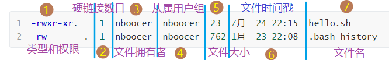

## 二）文件管理

### 名词解释

- **路径**: 由多级目录组成且中间使用斜杠连接的一串字符串。Windows 中开头必须是`盘符:\`，结尾必须是最后一级目录或文件名（Windows中除可执行文件，均需加扩展名）。如 Windows 中 cmd 的路径为： `C:\windows\system32\cmd.exe`。
- **绝对路径**: 如 `/tmp/level1`, `/home`  这种从根目录一直列的路径称之为绝对路径（`home` 是根目录下的文件夹）。
- **相对路径**: 如 `level/level2`  `level1`  `test` 这种从当前目录列的路径称之为绝对路径。
- **归档**: 同打包，与压缩不同。归档代表着将文件不经压缩放在一个包中，类似于复制。
- **解档**: 同解包，与解压不同。代表将归档的文件按照需要还原以供使用。
- **打包**: 即归档，与压缩不同。Linux中打包和压缩是两种不同的存在。归档代表着将文件不经压缩放在一个包中，类似于复制。
- **解包**: 即解档，与解压不同。代表将归档的文件按照需要还原以供使用。

### 切换、创建、删除目录

#### Linux 顶层目录结构

```
/			根目录
├── bin		存放用户二进制文件
├── boot	存放内核引导配置文件
├── dev		存放设备文件
├── etc		存放系统配置文件
├── home	用户主目录
├── lib		动态共享库
├── lost+found	文件系统恢复时的恢复文件
├── media	可卸载存储介质挂载点
├── mnt		文件系统临时挂载点
├── opt		附加的应用程序包（第三方软件建议安装目录）
├── proc	系统内存的映射目录，提供内核与进程信息
├── root	root 用户主目录
├── sbin	存放系统二进制文件（根用户可执行）
├── srv		存放服务相关数据
├── sys		sys 虚拟文件系统挂载点
├── tmp		存放临时文件
├── usr		存放用户应用程序
└── var		存放邮件、系统日志等变化文件
```

注：打开命令行默认处于登录用户的家目录

#### `cd` - 切换目录命令 （Change Directory）

| 符号 | 释义               | 示例                                                         |
| ---- | ------------------ | ------------------------------------------------------------ |
| `/`  | 根目录             | `cd /tmp`  切换目录到根目录下的 `/tmp` 目录                  |
| `.`  | 当前目录           | `cd ./dir01`  切换至当前目录下的 `dir01` 目录                |
| `..` | 上一级目录         | `cd ../dir02`  切换至上一层工作目录的 `dir02` 文件夹         |
| `-`  | 返回上次进入的目录 | `cd -`  返回上次进入的目录。按示例顺序执行命令则此时进入 `dir01` |
| `~`  | 用户家目录         | `cd ~`  回到用户的家目录                                     |

**注意事项：**

* 使用 `pwd` 可查看当前所在目录
* `cd -`  可以理解为 Windows 文件系统界面的返回，亦可理解为浏览器的返回上一页的返回
* `cd ~用户名` 表示进入xxx用户的家目录。如，`cd ~sudoer` 进入 sudoer 的家目录（波浪号和用户名之间的空格可有可无）

#### `mkdir` - 创建目录命令（Make Directory）

- `mkdir /tmp/test1` 在 `/tmp` 目录下创建 `/test1` 目录，创建后自动进入该目录，但只能创建一个子目录。（此处退回 `/tmp` 目录进行下一步操作）
- `mkdir -p /tmp/level1/level2` 在 `/tmp` 目录下创建多级目录

#### `rmdir` - 删除目录命令（Remove Directory）

* `rmdir test1`  删除当前目录的 `test1` 目录，但只能删除空目录。使用 `cd test1` 命令则提示该文件或目录不存在

#### 名词解释

**绝对路径：** 如 `/tmp/level1`  `/home`  这种从根目录一直列的路径称之为绝对路径。（`home` 是根目录下的文件夹）

**相对路径：** 如 `level/level2`  `level1`  `test` 这种从当前目录列的路径称之为绝对路径。

### 列出文件

#### `ls` - 列出文件命令（List）

语法： `ls [选项] [文件名|目录名|none]` 。`ls` 命令的选项后不跟任何东西表示显示当前目录文件。

* 列出所有文件：`ls -a`。包括隐藏文件（即名字以 `.` 大头的文件）。（`ls a` 即 List all）
* 列出文件的长格式：`ls -l filename`。即列出文件的详细信息（下文详解）。
* 列出当前文件夹的所有文件详细信息： `ls -al`，亦可写为 `ls -a -l` 。列出指定目录下的所有文件的详细信息。由两个命令组合而成。
* 列出文件的 inode-number：`ls -il` ，亦可写为 `ls -i -l`。

> 命令 `ll` 可以实现类似于 `ls -l` 的效果

#### `tree` - 列出树状目录与文件（日后补充）

此功能需要使用 `yum install tree` 安装。

### 文件格式与访问权限

#### 关于文件长格式

长格式共分为 7 个部分，称为 7 个字段，分别为：

1. 文件的类型和权限；
2. 文件的硬链接数目；
3. 文件属主；
4. 文件属组；
5. 文件大小；
6. 文件时间戳；
7. 文件名。

> 1、3、4 描述的是用户访问权限有关的东西。

长格式示例：

```bash
-rwxr-xr--.	 1  nboocer  nboocer  23  7月  24 22:15  hello.sh
-rw-------.  1  nboocer  nboocer  762 1月  23 22:08  .bash_history
```

图示：



> 「导航」：查看 [硬链接](#`ln`---创建硬链接)

#### 类型和权限解读

长格式第一个字段（上图序号①）表示文件的类型和权限。具体如下图。①表示具体的[文件类型](#文件类型)，②③④表示[文件访问权限](#文件访问权限)。


##### 对于①：文件类型

“类型和权限”第一个字符表示文件类型，不可更改

* `d` 目录文件
* `-` 或 `f ` 普通文件
* `c` 字符设备文件
* `b` 块设备文件
* `l` 符号链接文件

##### 对于②③④：文件访问权限

除去第一个字符后，以每三个字符分为一组，分别表示「文件拥有者」（Owner，即属主）、「文件从属用户组」（Group，即属组）里的用户、「其他用户」的文件访问权限。

`r`  读权限。可以查看文件的内容 

`w`  写权限。表示可以修改或删除该文件

`x`  执行权限。表示可以运行该文件

`-`  无相应权限。特定位置显示该符号表示没有相应权限

 `-rwxr-xr--`  表示该文件为普通文件。文件属主拥有可读、可写、可执行权限；文件属组用户拥有可读、可执行权限；其他用户拥有可读权限。

【文件访问权限的二进制写法】

```
rwx r-x r--  原格式（为方便观看每三个字符间增加了一个空格）
111 101 100  过渡格式（-表示0；其他表示1）
 7   5   4   二进制格式（将过渡格式按每三位一个二进制表示）
```

**验证**

准备工作：

- `mkdir ~/test`  创建目录
- `cd ~/test`  进入目录
- `nano hello.sh`  输入「hello」》`ctrl + o` 保存》回车》`ctrl + x` 退出到命令行模式。
- `ls -al`  列出所有文件，及其权限。

验证：

* `nano ./hello.sh` **打开** `hello.sh` 文件。  
* 在 nano 中尝试输入，**修改**该文件。
* `./hello.sh` **执行**文件。（作者由于执行权限处显示 `-` ，因此提示权限不够）。

#### 长格式类型和权限修改

##### `chmod` - 修改文件属性

* `chmod 700 hello.sh` 表示 `hello.sh` 的权限改为 `rxw------`，即文件属主拥有可读可写可执行权限，除此之外的其他用户无任何权限。（注意要在 `~/test` 目录下）

##### `chown` - 修改文件的属主和属组 

* `chown nbcc:stu hello.sh` 将文件的属主和属组分别改为 `nbcc` 和 `stu`
* `chown nbcc: hello.sh` 将文件的属主改为 `nbcc`
* `chown :stu hello.sh` 将文件的属组改为 `stu`

### 复制、移动、删除文件

#### `cp` - 复制文件命令（Copy）

语法：`cp [要复制的文件名|文件列表|目录] [目的文件名|目的目录]` 

**选项：**

| 选项   | 作用                                                         |
| ------ | ------------------------------------------------------------ |
| `-a`   | 此参数的效果和同时指定"`-dpR`"参数相同                       |
| `-R/r` | 递归处理，将指定目录下的所有文件与子目录一并复制过来         |
| `-f`   | 强制覆盖                                                     |
| `-p`   | 原样复制。复制时不修改文件的任何属性，以防没有权限使用。<br />但要求登录用户需对此文件拥有写权限 |

**示例：**

* 复制单个文件：`cp ~/test/hello.sh ~/test/hello_bak` 把 `hello.sh` 复制到 `~/test` 目录下，并重命名为 `hello_bak`
* 复制多个文件：`cp ~/test/hello.sh /tmp/level1/hello.sh ~/test2` 把前两个目录的文件复制到 `~/test2` 目录下

* 复制整个目录：`cp -r ~/test ~/test2` 目的目录存在和不存在时又分为两种情况。如果存在则把要复制的文件目录的文件名和该目录下的文件全部拷贝到目的目录
* 强制覆盖： `cp -f -r ~/test ~/test2`
* 原样复制：`cp -p ~/test ~/test2 ` 

**注意事项：**

使用cp命令时，在目的目录遇到同名文件，系统会提示是否覆盖

#### `mv` - 移动文件命令（Move） 

语法：`cp [选项]... [-T] 源文件 目的文件` 
    或：`cp [选项]... 源文件... 目录` 
    或：`cp [选项]... -t 目录 源文件...` 

mv 移动目录时不需要加任何选项。其他与 cp 命令大致相同。

`-v` 动态显示

`-u`, `-update` 之移动更新了的源文件 

**注意事项：**

* 移动目录时，与目的目录同名会提示是否覆盖，可通过在 `mv` 命令后添加 `-f` 强制覆盖
* Linux没有专门的重命名功能，但 `mv` 命令可以实现这个功能。如 `mv ~/test/hello_bak ~/test/hello_bak.sh`

#### `rm` - 删除文件命令（Remove）

语法：`rm [选项] <要删除的文件|文件列表|目录>`

**选项：**

| 选项    | 选项长格式    | 作用                                               |
| ------- | ------------- | -------------------------------------------------- |
| `-d`    | `--dir`       | 删除空目录。直接把欲删除的目录的硬连接数据删除成 0 |
| `-f`    | `--force`     | 强制删除文件，且绝不提示                           |
| `-i`    |               | 每次删除前提示                                     |
| `-I`    |               | 递归删除或一次性删除超过三个文件时提示             |
| `-r/-R` | `--recursive` | 删除文件目录及文件（递归删除）                     |
| `-v`    |               | 显示指令的详细执行过程                             |

**示例：**

* 删除单个文件： `rm /tmp/level1/hello.sh`
* 删除多个文件：`rm ~/test2/hello.sh ~/test2/hello_bak`
* 删除目录及目录中文件：`rm -R ~/test2`
* 强制删除且不提示： `rm -f ~/test/hello_bak`
* 组合命令：`rm -f -R` 或  `rm -fR` 强制删除目录及其文件。据本人猜测，任意多个以 `-` 开头的命令均可随意组合。

**注意事项：**

* 如果删除的目录或文件名以 `-` 开头，如 `-foo`，可以选择以下两种命令其中一种

  ```bash
  rm -- -foo
  ```

  ```bash
  rm ./-foo
  ```

* 使用 rm 来删除文件，通常仍可以将该文件恢复原状。如果想保证
  该文件的内容无法还原，请考虑使用 shred。

### 文件链接

关于软连接与硬链接的具体内容见[参考](#参考)

#### Linux 文件数据存储原理

我们知道文件都有文件名与数据，这在 Linux 上被分成两个部分：用户数据 (user data) 与元数据 (metadata)。用户数据，即文件数据块 (data block)，数据块是记录文件真实内容的地方；而元数据则是文件的附加属性，如文件大小、创建时间、所有者等信息。在 Linux 中，元数据中的 inode 号才是文件的唯一标识而非文件名。文件名仅是为了方便人们的记忆和使用，系统或程序通过 inode 号寻找正确的文件数据块。

在 Linux 系统中查看 inode 号可使用命令 `stat` 或 `ls -i`（若是 AIX 系统，则使用命令 `istat`）。

#### 链接分类

- **符号链接：**即软连接。文件用户数据块中存放的内容是另一文件的路径名的指向（类似于win中的快捷方式）。
- **硬链接：**让一个 inode-number 对应多个文件名，文件的 inode 和数据还是一份。

#### 符号链接 / 软连接（Symbolic Link / Soft Link）

**创建**

创建语法：`ln -s [链接指向的文件] [ [链接文件位置/] 链接名]`

创建示例：`ln -s ~/test/hello.sh ~/test2/hello_slink` （要求test2文件夹存在）

**特征**

- 软链接有自己的文件属性及权限等；
- 可对不存在的文件或目录创建软链接；
- 软链接可交叉文件系统；
- 软链接可对文件或目录创建；
- 创建软链接时，链接计数 i_nlink 不会增加；
- 删除软链接并不影响被指向的文件，但若被指向的原文件被删除，则相关软连接被称为死链接（即 dangling link，若被指向路径文件被重新创建，死链接可恢复为正常的软链接）。

#### 硬链接（Hard Link）

**语法**

查看：`ls -ial /folder/filename` 查看全部文件的 inode-number

创建：`ln [链接原文件] [链接目标文件]`

**示例**

* `ln ~/test2/hello.sh /hello_hl01` 可以使用 `/hello_hl01` 打开  `~/test2` 目录下的 `hello.sh` 文件名。（相当于多了一个文件名）
* `ln ~/test2/hello.sh /hello_hl02` 可以使用 `/hello_hl02` 打开  `~/test2` 目录下的 `hello.sh` 文件名。
* `ls -il ~/test2/hello.sh ~/hello_hl01 ~/hello_hl02` 查看硬链接的inode-number，该值一样则为同一文件。另外，如果一文件会在系统中通过色块标识。

**特征**

由于硬链接是有着相同 inode 号仅文件名不同的文件，因此硬链接存在以下几点特性：

- 文件有相同的 inode 及 data block；
- 只能对已存在的文件进行创建；
- 不能交叉文件系统进行硬链接的创建；
- 不能对目录进行创建，只可对文件创建；
- 删除一个硬链接文件并不影响其他有相同 inode 号的文件。

> **删除注意事项**
>
> 对于创建了硬链接的文件，按原文件名删除后仍然可以使用该文件。
>
> 如删除 `~/test2` 目录下的 `hello.sh` 文件 ：
>
> ```bash
> rm ~/test2/hello.sh
> ```
>
> 经使用 `cat /hello_hl01` 和 `cat /hello_hl02` 命令，发现文件仍可以打开。因此直到将硬链接删除干净，文件才算彻底被删除。

**注意事项**

* 不建议为目录创建硬链接。[为什么?](http://c2.com/cgi/wiki?HardLink)
* 不能夸硬盘分区创建硬链接。（不同分区的 inode-number 不唯一）

> **拓展：**查看每个硬盘分区的inode总数和已经使用的数量，可以使用df命令。
>
> ```bash
> df -i
> ```

### 打包和压缩文件

`.tar`  表示打包文件，`.gz` 表示使用 gzip 压缩的文件。不强制要求使用此后缀，但使用此后缀更方便理解。

#### `tar`- 打包命令（tape archive）

名字由来：由于最初的打包目的用于将文件备份至磁带上，因此得名 tape archive。

表层原理：把文件前后连接在一起，形成一个大文件，并**不对文件进行压缩**。

**语法**

`tar <操作> [选项] [文件或目录]`

*注：使用该命令时，操作必须有，它告诉 tar要做什么事情，选项是辅助使用的，可以选用。*

**主操作模式【以下参数不可一起使用】**

- `-A` 合并两个归档文件
- `-c`, `--create` 创建一个归档[^归档]文件（即打包）
- `-d`, `--diff`, `--compare` 找出归档和文件系统的差异
- `-t`, `--list` 列出归档文件中的文件
- `-r`, `--append` 向归档文件末尾追加文件
- `-u`, `--update` 只追加比归档文件更新的文件
- `-x`, `--extact`, `--get` 从归档文件中解出文件（即解包[^解包]）

**选项**

- `-C`, `--directory`=`DIR`    指定一个解档目录（解档目录必须存在）
- `--delete`    从归档文件中删除一个文件
- `-f`, `--file`=`ARCHIVE`   指定一个归档文件/设备进行操作。 `-f` 后紧跟归档文件名（中间空格可有可无）
- `-j`, `--bzip2`    通过bzip2压缩解压缩归档
- `-p`    使用原文件的原来属性（属性不会依据使用者而变）
- `-v`, `--verbose`    详细地列出处理的文件，常和 t 连用。如 `tar -tvf test.tar`，列出归档中文件的长格式（常用）
- `-X`, `--exclude-from`=`FILE`   表示在压缩的过程中，不要将 FILE 打包
- `-z`, `--gzip`, `--gunzip`,  `--ungzip`    调用gzip来压缩/解压缩归档
- `-Z`, `--compress`, `--uncompress`    通过compress压缩解压缩归档

> 打包多个文件或目录：`tar -cf [打包文件名] [要打包的文件/列表]` c 代表创建，f 代表文件。

**示例**

* 打包多个文件/目录：`tar -cf hello.tar ~/test/hello.sh ~/test/hello_bak.sh ` 
* 从归档中解出文件：`tar -xvf hello.tar -C ~/tar`
* 在打包文件末尾添加文件：`tar -f hello.tar -r hello_hl01`
* 列举归档中文件的长格式：`tar -tvf hello.tar`

**注意事项**

- 归档文件的「.tar」后缀名不是必须的，但是一般我们都会加上这个后缀，以告诉用户这个文件是一个归档文件

#### `gzip` - 压缩文件

**语法**

`gzip [选项] 压缩|解压缩的文件名`

**选项**

- `-c`        将输出写到标准输出上，并保留原有文件。
- `-d`        将压缩文件解压。
- `-r`         递归式压缩/解压缩指定目录中的所有文件。
- `-num`    用指定的数字 num (1~9) 调整压缩的速度和压缩比。
- `-v`         对每一个压缩和解压的文件显示文件名和压缩比。人话：动态显示加锁或解压的详细信息。
- `-S`, `--suffix=SUF`  自定义压缩文件后缀名，默认 `.gz` 。
- `-t`         测试，检查压缩文件是否完整。

> **注意**
>
> - gzip 在压缩文件过程中，会自动为文件添加一个“.gz”的后缀名，并且将原文件删除，另外解压缩时也会自动将源文件删除
> - 如果要保留原文件，就必须使用-c 选项和Shell的输出重定向机制（在后面会进行详细讨论）

**示例**

* 压缩：`gzip ~/hello.tar`
* 解压：`gzip -d ~/hello.tar.gz`

### 查找文件

#### `locate` - 查找文件命令

**locate命令**和**slocate命令**都用来查找文件或目录。

locate命令其实是`find -name`的另一种写法，但是要比后者快得多，原因在于它不搜索具体目录，而是搜索一个数据库`/var/lib/locatedb`，这个数据库中含有本地所有文件信息。Linux系统自动创建这个数据库，并且每天自动更新一次，所以使用locate命令查不到最新变动过的文件。为了避免这种情况，可以在使用locate之前，先使用 [updatedb](http://man.linuxde.net/updatedb)命令，手动更新数据库。

**语法：**`locate/slocate [选项]... [模式]...` 

**选项：**

```
-d<目录>或--database=<目录>：指定数据库所在的目录；
-u：更新slocate数据库；
```

**模式：**搜索的内容

**示例：**`locate .tar`  查找文件名中包含 `.tar` 的文件

#### `find` - 查找文件命令（重点）

查找较慢，但功能丰富。

**语法：**

简易：`find [查找范围(可省略)] [查找选项] [动作]`

复杂：`find  <path> <-option> [-print | -ls]  [-exec|-ok <command> {} \;]`

**查找选项**

- `-print`    将查找到的文件输出到标准输出
- `-fprint  <filename>` 将查找到的文件输出到指定文件  
- `-exec command {} \;`   将查到的文件执行command操作，`{}`代表查找到的文件，`\;`代表结束。(`{}` 和 `\;`之间有空格)
- `-ok  command {} \;`       和 `-exec` 相同，只不过在操作前要询问用户
- `-name <filename>`  : 查找名为filename的文件，即按文件名查找。
- `-iname <filename>`    : 与`-name`相同,只是忽略大小写(-i);    
- `-perm <n(8)> `   : 按执行权限来查找，n为八进制的三位数字，每个数字代表所属用户的权限，如754
- `-user <username>` : 按文件属主来查找   
- `-uid <uid>` : 按文件属主ID来查找    
- `-group <groupname>` : 按文件属组来查找    
- `-gid <gid>` : 按文件属组ID来查找    
- `-amin  <-n|+n> ` : 按文件访问时间来查找文件，-n指n分钟以内,+n指n分钟以前    
- `-atime <-n|+n>` : 按文件访问时间来查找文件，-n指n天以内,+n指n天以前    
- `-cmin  <-n|+n>` : 按文件创建时间来查找文件，-n指n分钟以内,+n指n分钟以前    
- `-ctime <-n|+n> ` : 按文件创建时间来查找文件，-n指n天以内,+n指n天以前    
- `-mmin  <-n|+n>` : 按文件更改时间来查找文件，-n指n分钟以内,+n指n分钟以前    
- `-mtime <-n|+n|n>` : 按文件更改时间来查找文件，-n指n天以内，+n指n天以前，只有 n 表示第 n 天
- `-size <+n|-n>`  :  根据文件大小查找文件，+n表示超过n大小的文件，-n表示小于n大小的文件
- `-empty`: 空白文件、空白文件夹、没有子目录的文件夹    
- `-newer <f1 !f2>` : 查更改时间比f1新但比f2旧的文件    
- `-type <b|d|c|p|l|f>` : 查是块设备/目录/字符设备/管道/符号链接/普通文件     
- `-prune`: 忽略某个目录

**示例：**

* 根据文件名进行查找：`find ~ -name hello.sh ` 。注意文件名为全称，如果使用关键字进行查找则需使用通配符。
* 根据文件类型进行查找：`find /bin -type l `。（查找bin目录下文件的符号链接文件）

* 组合查找：`find ~ \( -ctime -10 -a -size +1c -a -type f -a -name hello.* \) -ls` 。（找到家目录下十天以内创建的以 `hello.` 为前半部分命名的文件，`*` 表示[通配符](#通配符)）
* `-exec` 示例：`find ~/test \( -mtime -10 -a -type d \) -exec tar -cf {}.tar {} \; `

**注意：**

-  `-size <n[c|w|b|k|M|G]>`，其中：n表示文件大小的数值，b  表示512字节的块，c 表示字节，k 表示K字节，M 表示M字节（1024\*1024字节=1024k），G 表示G字节（1024\*1024\*1024字节=1024M）
-  `-type <[b|c|d|p|f|l|s]>`，其中b表示块设备文件，c表示字符设备文件，d表示目录，p表示命名管道文件，f表示普通文件，l表示符号链接文件，s表示socket文件 
-  find 命令的所谓“命令动作（Actions）”，表示在查找到文件后，要对这些文件所做的操作，我们在这里只介绍其中三个常用的命令动作：
   - `–print`：find命令的默认动作，将查找到的文件名输出
   - `–ls`：将将查找到的文件名以 `ls –dils` 格式输出
   - `-exec command {} \;` ：对查找到的文件名执行指定命令，命令command由用户指定，用 `{}` 代表查找到的文件，用 `\;` 结束。因为 `;` 在 bash 中有特殊意义，因此分号前需要添加转义字符。
   - `-ok  command {} \;` ：与`-exec`非常类同，只不过在对文件执行指定命令之前会询问用户是否执行
-  在Linux中与文件相关的时间属性有三个：
   - atime：文件最后被访问时间(Time when file data  was last accessed.)，atime  是在读取文件或者执行文件时更改的。
   - mtime：文件内容最后被更改的时间(Time when data was  last modified.)，mtime  是在写入文件时随文件内容的更改而更改的

   - ctime：文件状态（属性或者内容）最后被更改的时间(Time when file  status was last changed)，ctime  是在写入文件、更改所有者、权限或链接设置时随 Inode 的内容更改而更改的。
-  常常在一些文章和资料中提到的文件时间戳(Timestamp)指的是文章的mtime。
-  在find命令支持用逻辑运算符来操作单个逻辑条件，或者将逻辑条件连接起来：
   - `–a` 表示与 
   - `–o` 表示或
   - `!` 表示取反
-  使用多个条件时，这些条件要用圆括号括起来，左右圆括号还要使用反斜杠 `\` 来进行转义，以防止 shell 的解释。

### 通配符

Shell 常用通配符：

| 字符                    | 含义                                                         |
| ----------------------- | ------------------------------------------------------------ |
| `*`                     | 匹配 0 到多个字符                                            |
| `?`                     | 匹配任意一个字符                                             |
| `[list]`                | 匹配 list 中的任意单一字符                                   |
| `[^list]`               | 或 `[!list]` ，匹配 除list 中的任意单一字符以外的字符        |
| `[c1c2...cn]`           | 匹配中括号之间字符列表中的任意单一字符                       |
| `[c1-c2]`               | 匹配 c1-c2 中的任意单一字符 如：\[0\-9\]\[a\-z\]\[a\-zA\-Z\] |
| `{string}`              | 匹配 string 中全部字符 如{0123456789}                        |
| `{string1,string2,...}` | 匹配 string1 或 string2 (或更多)其一字符串                   |
| `!`                     | 对中括号或花括号中的内容取反                                 |

### 创建文件

#### `touch` 命令

本身用于更新文件的访问和修改时间。但如果这个命令后接的文件不存在，则会创建一个空的文件。

**语法**：`touch <file>`

**示例**

* 创建文件：`touch ./hello.txt`

#### `vim` 命令

`vim <filename>` 文件不存在时，输入内容，按 `:wq` 即可写入内容并创建文件。

#### 另一种奇淫巧技：`cat` 命令

- `cat>>filename` 使用cat创建文件时，以系统默认的文件属性作为新文件的属性，并接受键盘输入作为文件的内容。输入结束时按`Ctrl`+`d`退出并保存文件。
- `cat file1 file2>>file3`  将  file1 和 file2 合并到一个新的文件当中。（合并前需要确保这三个文件存在）

> 注：根据多方查找，linux中似乎并不存在创建文件的同时创建目录的命令。

### 查看文本文件

> 非常重要。主要用于查看日志、配置等，十分常用

相关命令 `cat, less, more, head, tail...`

#### `cat` 命令（concatenate 连接缩写）

`cat` 本身是连接文件、查看文件用的，上文创建文件的做法只是一种奇淫巧技。

**示例**

* `cat /etc/passwd` 查看系统的用户配置文件

| 温馨提示                 |
| ------------------------ |
| `cat` 适合查看较小的文件 |

#### `more` 命令

查看文件，适合查看内容较多的文件。缺点是不支持向前翻页（可能是我不会看 help 文件吧）。

**技巧**

- 按 `空格` 或 `z` 向下翻页
- 按 `回车` 向下 1 行。按 `数字N` + `回车`，向下 `N` 行
- 按 `q` 退出
- 按 `h` 进入帮助（按理来说，按照帮助里的提示，按 `b` 是可以向上一行的，但是并不可以）

**示例**

* `more /etc/passwd` 查看系统的用户配置文件
* `ss -anp | more` 把 `ss -anp` 的输出传给 `more` 命令

#### `head` 和 `tail` 命令（头和尾）

这一对命令一般用于查看日志文件。head 用于查看文件的头几行，tail 同理。

**示例**

* `head -n 20 /var/log/messages` 查看文件的头20行，不足20行显示全部
* head 后不跟 -n 和参数默认显示前 10 行
* `tail -f 300 fileName`  浮动（实时）查看日志尾部 300 行数据

#### `less` 命令

**示例**

* `less /var/log/message` 查看 `/var/log/message` 的日志文件

**技巧**

进入 less 命令后：

* 使用 `h` 查看帮助
* 使用 `q` 退出，回到命令行
* 使用 `y` 上移一行（或使用 `上箭头`）
* 使用 `e` 下移一行（或使用 `下箭头`）
* 使用 `/关键字` 在文件中查找相应关键字
  * `n` 跳转到下一个关键字
  * `N` 跳转到上一个关键字
* 使用 `g` 进入第一行
* 使用 `G` 进入最后一行
* 使用 `Ctrl`+`b` 向上翻一页（或使用 `Page Up`）
* 使用 `Ctrl`+`f` 向下翻一页（或使用 `Page Down`）

### 参考

1. [中国大学慕课-Linux系统管理](https://www.icourse163.org/course/NBCC-437004?tid=1002729007) 视频教程
2. [理解 Linux 的硬链接与软链接](https://www.ibm.com/developerworks/cn/linux/l-cn-hardandsymb-links/index.html)