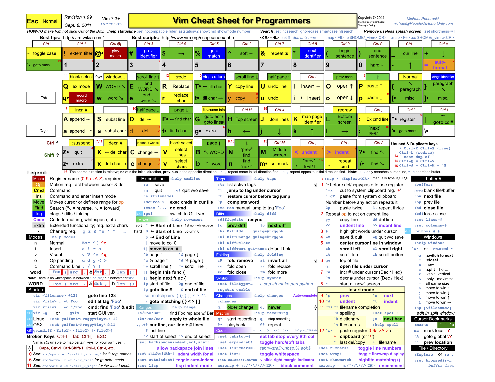

## vim 文本编辑器

> 除了参考本书，你也可以在你的 Linux 上直接运行 `vimtutor ` 命令，这是一个大约30分钟的教程。

### 入门

#### 介绍

编辑器可以分为「图形模式的编辑器」和「文本模式的编辑器」，在 Linux 我们通常使用「文本模式的编辑器」。比如 vi、vim、emacs、joe、pico、nano。本章所讲的就是名为 vim 的文本编辑器。 vim（Vi IMproved）是 vi 的改进版，大多数情况下两个编辑器的操作相同。

#### 使用

##### 准备工作

大部分情况下 Linux 发行版本都是预装了 vim 的。万一你的主机上还没安装 vim，请输入如下命令安装它。

```bash
[root@localhost ~]# yum install vim 
```

##### 运行 vim

启动 vim 编辑器的命令：

```bash
$ vim
```

使用 vim 打开文件的命令：

```bash
[root@localhost ~]# vim file.txt 
```

以上命令表示：存在 `file.txt` 则使用 vim 打开，不存在则创建该文件并打开

### Vim 模式

包括普通模式、插入模式、命令行模式、选择模式、Ex 模式共计 5 种模式。常用普通模式、插入模式和命令行模式这三种。

#### 普通模式

##### 进入

默认进入普通模式。该模式不可进行输入，可进行如移动光标、删除、复制、粘贴等。底部显示的是文件名或者空白。

以下涉及到的字母如无例外均严格区分大小写。涉及到的大写按键可通过 `Shift + 字母按键` 输入。

##### 移动光标

| 按键               | 说明                               |
| ------------------ | ---------------------------------- |
| `h`, `j`, `k`, `l` | 分别表示左、下、上、右移动光标     |
| `gg`               | 移动到首行行首                     |
| `G`                | 移动到末行行首                     |
| `0` 或 `^`         | 移动到当前行首                     |
| `$`                | 移动到当前行尾                     |
| `w`                | 到下一个单词的开头                 |
| `b`                | 到前一个单词的开头                 |
| `e`                | 到当前单词的结尾                   |
| `ge`               | 到前一个单词的结尾                 |
| `Ctrl + F`         | 向前翻页                           |
| `Ctrl + B`         | 向后翻页                           |
| `Ctrl + o`         | 快速回到上一次(跳转前)光标所在位置 |

数字+以上按键：

- `8l` 向右移动 8 个字符
- `3j` 向下移动 3 行
- `20gg` 移动到第 20 行行首
- `3G` 移动到第 3 行行首，作用同 `3gg`
- `10$` 下移 10 行，并定位到行尾
- `10w`  光标向后移动10 个单词，停在单词的第一个字母上
- `5e`  如果光标在当前单词末尾处，则光标向后移动 5个单词，停在在单词的最后一个字母上；否则移动 4 个单词

##### 匹配搜索操作

| 命令      | 说明                                                       |
| --------- | ---------------------------------------------------------- |
| `f<字母>` | 向后搜索<字母>并跳转到第一个匹配的位置(非常实用)           |
| `F<字母>` | 向前搜索<字母>并跳转到第一个匹配的位置                     |
| `t<字母>` | 向后搜索<字母>并跳转到第一个匹配位置之前的一个字母(不常用) |
| `T<字母>` | 向前搜索<字母>并跳转到第一个匹配位置之后的一个字母(不常用) |

##### 删除操作

进入普通模式，使用下列命令可以进行文本快速删除：

| 按键      | 说明                               |
| --------- | ---------------------------------- |
| `x`       | 删除游标所在的字符（小写 `x`）     |
| `X`       | 删除游标所在前一个字符（大写 `X`） |
| `Delete`  | 同 `x`                             |
| `dd`      | 删除整行                           |
| `dw`      | 删除一个单词（不适用中文）         |
| `daw`     | 删除一个单词（不适用中文）         |
| `d$`或`D` | 删除至行尾                         |
| `d^`      | 删除至行首                         |
| `dG`      | 删除到文档结尾处                   |
| `d1G`     | 删至文档首部                       |
| `J`       | 删除选中行的换行符                 |

数字+以上命令，如：

- `ndd` 删除从光标行开始的向下 n 行
- `nx` 从光标所在处开始删除 n 个字符
- `dnw` 删除 n 个单词

##### 复制、剪切与粘贴操作

【复制】

| 按键         | 说明                                |
| ------------ | ----------------------------------- |
| `y`          | 复制                                |
| `yy`         | 复制光标所在行（`3yy` 表示复制3行） |
| `y^` 或 `y0` | 复制至行首。不含光标所在处字符。    |
| `y$`         | 复制至行尾。含光标所在处字符。      |
| `yw`         | 复制一个单词。                      |
| `y2w`        | 复制两个单词。                      |
| `yG`         | 复制至文本末。                      |
| `y1G`        | 复制至文本开头。                    |

【粘贴】

| 按键      | 说明                   |
| --------- | ---------------------- |
| `p`(小写) | 代表粘贴至光标后（下） |
| `P`(大写) | 代表粘贴至光标前（上） |

【剪切】

其实前面讲得 `dd` 删除命令就是剪切，你每次 `dd` 删除文档内容后，便可以使用 `p` 来粘贴，也这一点可以让我们实现一个很爽快的功能——交换上下行：~

`ddp`，就这么简单，即实现了快速交换光标所在行与它下面的行。

##### 替换操作

| 按键             | 说明                                         |
| ---------------- | -------------------------------------------- |
| `r+<待替换字母>` | 将游标所在字母替换为指定字母                 |
| `R`              | 连续替换，直到按下`Esc`                      |
| `cc`             | 替换整行，即删除游标所在行，并进入插入模式   |
| `cw`             | 替换一个单词，即删除一个单词，并进入插入模式 |
| `C`(大写)        | 替换游标以后至行末                           |
| `~`              | 反转游标所在字母大小写                       |

##### 撤销与恢复操作

| 按键      | 说明                                       |
| --------- | ------------------------------------------ |
| `u`       | 撤销一次（返回上一步操作状态）             |
| `u<n>`    | 撤销一次或 n 次操作，如 `u7` 撤销 7 次改变 |
| `U`(大写) | 撤销当前行的所有修改                       |
| `Ctrl+r`  | 恢复一次撤销的操作                         |

##### 缩进操作

【缩进操作按键】

| 按键 | 说明           |
| ---- | -------------- |
| `>>` | 整行将向右缩进 |
| `<<` | 整行向左回退   |

【设置缩进长度】（`shiftwidth`）

```bash
:set shiftwidth=10
```

设置缩进为 10 个字符

##### 其他操作

* `~` 转换大小写。
* `Shift + zz` 保存并退出 vim。

#### 插入模式

##### 进入

普通模式下按 `i` 键进入（或通过以下按键进入），按 `ESC` 退出。底部显示的是 `INSERT` 或者插入。下表为普通模式进入插入模式的其他命令。

| 按键 | 说明                                     |
| ---- | ---------------------------------------- |
| `i`  | 在当前光标处进行编辑                     |
| `a`  | 在光标后插入编辑                         |
| `I`  | 在行首插入                               |
| `A`  | 在行末插入                               |
| `O`  | 在当前行前插入一个新行                   |
| `o`  | 在当前行后插入一个新行                   |
| `cw` | 替换从光标所在位置后到一个单词结尾的字符 |

#### 命令模式

##### 进入

使用执行命令（`:`键），搜索命令（`/`和`?`键）或者过滤命令（`!`键）进入命令模式，按 `ESC` 退出。可进行如打开、保存、查找、替换等操作。以下命令输入后需回车方可生效。

##### 帮助命令 `:h`

查看 `/` 键帮助

```
:h / 
```

查看 `x` 键帮助

```
:h x
```

##### 保存、退出操作

| 命令                 | 说明             |
| -------------------- | ---------------- |
| `:q`                 | 退出             |
| `:q!`                | 强制退出，不保存 |
| `:x`                 | 保存并退出       |
| `:wq`                | 保存并退出       |
| `:wq!`               | 强制保存并退出   |
| `:w`                 | 保存，但不退出   |
| `:w <文件路径>`      | 另存为           |
| `:saveas <文件路径>` | 另存为           |

##### 位置操作

| 命令  | 说明                    |
| ----- | ----------------------- |
| `:ce` | (center) 使本行内容居中 |
| `:ri` | (right) 使本行文本靠右  |
| `:le` | (left) 使本行内容靠左   |

##### 查找操作

| 命令                | 说明                   |
| ------------------- | ---------------------- |
| `/<要查找的字符串>` | 向下查找要查找的字符串 |
| `?<要查找的字符串>` | 向上查找要查找的字符串 |
| `n`                 | 查找下一个内容         |
| `N`                 | 查找上一个内容         |
| `:noh`              | 取消查找               |

进入查找之后，输入`n`查找下一个内容，`N`查找上一个内容。

【示例】

- 从头搜索：`/hello`
- 从尾搜索：`?hello`

【精确搜索】

`\<` 表示匹配单词开头，`\>` 表示匹配单词末尾，匹配完整单词”`?\<hello\>`“或者”`/\<hello\>`"

如输入"`/hel`"、"`/\<hel`"、"`/llo\>`"，可能搜索到 `hello`

【查找忽略大小写】

原文：[vim 查找时忽略大小写](http://www.361way.com/vim-ignorecase/2329.html)

方式一  指令设定：

```
:set ic		#(ignorecase 的缩写) 忽略大小写
:set noic	#(noignorecase 的缩写) 不忽略大小写
```

方式二  查找符号设定：

```
/\CWord	#区分大小写的查找
/\cword #不区分大小写的查找 
```

【显示行号】

```
:set nu
```

【取消显示行号】

```
:set nonu
```

【保存时需要权限】

```
:w !sudo tee %
```

##### 分屏

| 命令               | 说明                                          |
| ------------------ | --------------------------------------------- |
| `:term <bashname>` | 打开某个终端。比如 `:term bash` ，打开 `bash` |
| `:sp [filename]`   | 水平分屏                                      |
| `:vsp [filename]`  | 垂直分屏                                      |
| `:close!`          | 关闭窗口                                      |

或快捷键命令：`^w` + 

* v 垂直分屏
* s 水平分屏
* w 切换窗口
* c 关闭窗口
* `h | j | k | l` 分别表示移动至左、下、上、右窗口

##### 多文件编辑

第一个打开的文件编号为 1，第二个打开的文件编号为 2，以此类推。

###### 使用 vim 打开多个文件编辑

```bash
vim 1.txt 2.txt
```

###### 切换文件命令

| 命令  | 说明                       |
| ----- | -------------------------- |
| `:n`  | 编辑下一个文件             |
| `:N`  | 编辑上一个文件             |
| `:n!` | 不保存强制切换到下一个文件 |
| `:N!` | 不保存强制切换到上一个文件 |

###### 对新文件的操作

| 命令                 | 说明                             |
| -------------------- | -------------------------------- |
| `:e <新文件名>`      | 打开新文件                       |
| `:e! <新文件名>`     | 放弃正在编辑的文件，打开新文件   |
| `:e #`               | 回到前一个文件                   |
| `:ls`                | 列出以前编辑过的文档             |
| `:b <文件名或编号>`  | 直接进入该文件编辑               |
| `:bd <文件名或编号>` | 删除以前编辑过的列表中的文件项目 |
| `:f`                 | 显示正在编辑的文件名             |
| `:f <另一文件名>`    | 把正在编辑的文件名改为另一文件名 |

###### 恢复文件

如果因为断电等原因造成文档没有保存，可以采用恢复方式，`vim -r <文件名>`恢复崩溃的会话。

#### 可视模式

与普通模式比较相似。但是移动命令会扩大高亮的文本区域。

**进入**

- 按 `v` （小写）进入「可视」模式（底部显示 `VISUAL` 或 `可视`）
- 按 `V` （大写）进入「可视 行」模式
- 按 `Ctrl`+`V`  进入「可视 块」模式

**操作**

- `d`  	剪切操作

- `y`  	复制操作

- `p`  	粘贴操作

- `^`  	选中当前行，光标位置到行首（或者使用键盘的HOME键）

- `$`  	选中当前行，光标位置到行尾（或者使用键盘的END键）

-  `Shift`+`i` 进入「插入」模式

#### 选择模式

这个模式和无模式编辑器的行为比较相似（Windows标准文本控件的方式）。这个模式中，可以用鼠标或者光标键高亮选择文本，不过输入任何字符的话，Vim会用这个字符替换选择的高亮文本块，并且自动进入插入模式。

进入：普通模式下，可以按gh进入。

#### Ex 模式

这和命令行模式比较相似，在使用`:visual`命令离开Ex模式前，可以一次执行多条命令。

进入：普通模式下按Q进入Ex模式。

### 高级操作

#### 视窗操作

vim 可以在一个界面里打开多个窗口进行编辑，这些编辑窗口称为 vim 的视窗。

##### 命令行操作

| 命令            | 说明                               |
| --------------- | ---------------------------------- |
| `:new`          | 打开一个新的vim视窗                |
| `:sp <文件名>`  | 打开新的水平分屏视窗来编辑新的文件 |
| `:vsp <文件名>` | 打开新的垂直分屏视窗来编辑新的文件 |

##### 快捷键操作

| 命令               | 说明                                              |
| ------------------ | ------------------------------------------------- |
| `Ctrl+w s`         | 将当前窗口分割成两个水平的窗口                    |
| `Ctrl+w v`         | 将当前窗口分割成两个垂直的窗口                    |
| `Ctrl+w q`         | 结束分割出的视窗，同 `:q`。使用 `:q! ` 强制结束。 |
| `Ctrl+w o`         | 打开一个视窗并且隐藏之前的所有视窗                |
| `Ctrl+w <h/j/k/l>` | 移至左/下/上/右面视窗                             |
| `Ctrl+w <H/J/K/L>` | 将当前视窗移至左/下/上/右面                       |
| `Ctrl+w -`         | 减小视窗的高度                                    |
| `Ctrl+w +`         | 增加视窗的高度                                    |

#### Vim 编辑器参数

| 参数           | 说明                             |
| -------------- | -------------------------------- |
| `-y`           | 容易模式 (同 "evim"，无模式)     |
| `-R`           | 只读模式 (同 "view")             |
| `-l`（小写L）  | Lisp 模式                        |
| `-x`           | 编辑加密的文件                   |
| `+`            | 启动后跳到文件末尾               |
| `+<lnum>`      | 启动后跳到第 `<lnum>` 行         |
| `-c <command>` | 加载第一个文件后执行 `<command>` |
| `-n`           | 不使用交换文件，只使用内存       |
| `-r`           | 列出交换文件并退出               |
| `-r <文件名>`  | 恢复崩溃的会话                   |

#### 在 vim 执行外部命令

在命令行模式中输入`!`可以执行外部的shell命令

| 命令            | 说明                                            |
| --------------- | ----------------------------------------------- |
| `:!ls`          | 用于显示当前目录的内容                          |
| `:!rm FILENAME` | 用于删除名为 FILENAME 的文件                    |
| `:w FILENAME`   | 将当前 VIM 中正在编辑的文件另存为 FILENAME 文件 |

#### 查看帮助

- 普通模式下按`F1`打开`vim`自己预设的帮助文档
- 命令行模式下输入`:h shiftwidth` 打开名为`shiftwidth`的帮助文件
- 命令行模式下输入`:ver` 显示版本及参数

#### 功能设定

可以在编辑文件的时候进行功能设定，如命令行模式下输入`:set nu`（显示行数）。

设定值退出vim后不会保存。要永久保存配置需要修改vim配置文件。 

##### vim 配置文件位置（Cent OS 7 环境）：

用户个人配置文件在 `~/.viminfo`；
全局配置文件在 `/etc/vimrc`（其他版本有可能在 `/etc/vim/vimrc`）。

##### 设置配置

打开设置：`:set 参数`

关闭设置：`:set no参数`

```bash
# 打开
:set number

# 关闭
:set nonumber
```

上面代码中，井号开始的行表示注释。

查询某个配置项是打开还是关闭，可以在命令模式下，输入该配置，并在后面加上问号。

```bash
:set number?
```

上面的命令会返回`number`或者`nonumber`。

##### 获取目前的设定

- 命令行模式下输入`:set`或者`:se`显示所有修改过的配置
- 命令行模式下输入`:set all` 显示所有的设定值
- 命令行模式下输入`:set option?` 显示option的设定值
- 命令行模式下输入`:set nooption` 取消当前设定值

##### set 功能的说明

- 命令行模式下输入`:set autoindent(ai)` 设置自动缩进
- 命令行模式下输入`:set autowrite(aw)` 设置自动存档，默认未打开
- 命令行模式下输入`:set background=dark`或`light`，设置背景风格
- 命令行模式下输入`:set backup(bk)` 设置自动备份，默认未打开
- 命令行模式下输入`:set cindent(cin)` 设置C语言风格缩进

### Vim 实践

#### 准备工作

- 在 `/tmp` 目录下建立一个名为 vimtest 的目录，并进入该目录。

- 使用 vim 新建一个 `hellovim.txt` 的文件。

- 按 `i` 进入插入模式，在文件中输入任意一段话并保存。如：

  ```
  ===============================================
  This is a test.
  This is a test for vim.
  I want to learn Linux.
  I want to learn Linux very well.
  Because I'd like to be rich on the mental and the material.
  so I must study hard for making my dream can come true one day.
  ===============================================
  ```

- 将 `/etc/man_db.conf` 文件拷贝到本目录下。

- 使用 vim 打开这个文本文件。

#### 1 设定行号

**任务：**设定行号

行号属于 vim 的**环境参数**。

**环境参数**

设置环境参数：Set 环境参数

取消设置环境参数：Set no环境参数

查阅设置参数：在一般模式下输入 `: set all` 查阅

**步骤**

* 按 `:` 进入命令模式
* 输入 `set nu` 即可设置行号
* 输入 `set nonu` 取消设置行号

#### 2 移动光标

**任务：**移动到第 58 行行首，再右移 30 个字符，移动到第 8 行行尾，再向左移动 3 列，最后移动到文件末行

**步骤**

#### 3 移动并搜索

**任务：**移动到第一行行首，并且向下搜索“man”这个字符串。

**步骤**

* 正常模式下键入 `/` 进入命令模式。
* 输入 `man` 回车，表示从光标处向下查找字符串。
* 用 `n` 继续向下查找字符串
* 用 `N` 向上查找字符串。

#### 4 自由替换

**任务：**将 50 到 100 行之间的 man 替换为 MAN ，并自行选择是否替换。

**语法：**`:n1,n2s/word1/word2/gc`

**解释：**表示在 n1 和 n2 两行之间查找 word1 字符串并使用 word2 替换。

**注意**

- 末尾的 `c` 表示每次替换前询问（可省略）。
- 可使用 `$` 代表最后一行

#### 5 复制并粘贴

**任务：**复制 51 到 60 行的内容，并粘贴到最后一行。

- `yy` 复制光标所在行
- `nyy` 复制从光标行开始向下复制 n 行
- `p` 在光标一行粘贴

#### 6 删除

**任务：**删除 11 到 30 行之间的 20 行，去第 29 行首，并且删除 15 个字符。

- `dd` 删除光标所在行
- `ndd` 删除从光标行开始的向下 n 行
- `x` 删除光标所在处的字符
- `nx` 从光标所在处开始删除 n 个字符

#### 7 撤销更改

**任务：**撤销之前的所有更改

* `u` 撤销一次
* `:e!` 撤销全部操作

#### 8 另存为

**任务：**将这个文件另存成一个名为 `man_db.conf.bak` 的文件

**语法：**`:w man_db.conf.bak`

**解释：**`:w` 是保存，后面的字符串表示另存为 xxx

#### 9 插入其他文件内容

**任务：**在最后一行后插入当前目录下 hellovim.txt 文件内容并保存。

**语法：**`:r ./hellovim.txt`

**解释：** 将 hellovim.txt 插入文件末尾。`:r` 表示读文件命令，后面文件名目录表示将这个文件的内容追加到光标所在行的后面。

**保存并退出：**`:wq` 回车

#### 10 同时打开多个文件

**任务：**同时打开 `man_db.conf` 和 `man_db.conf.bak` 。（此处已退出编辑器）

 **步骤**

* `vim 文件1 文件2 ... 文件n` 打开多个文件
* `:n` 切换到打开的下一个文件
* `:N` 切换到打开的上一个文件

#### 11 多个文件间的复制与粘贴

**任务：**将 `man_db.conf.bak` 中插入的 hellovim.txt 文件内容的第 1 列到第 10 列复制到 `man_db.conf` 中。

**步骤**

- 进入可视模式
- 移动光标选中文本（被选中的文本高亮显示）
- 使用 `y` 进行复制
- 存储两个文件并退出

### Vim Cheat Sheet（Vim 快捷键一览图）




### 参考

1. [实验楼·Vim编辑器](https://www.shiyanlou.com/courses/2)
2. [中国大学慕课-Linux系统管理](https://www.icourse163.org/course/NBCC-437004?tid=1002729007) 视频教程