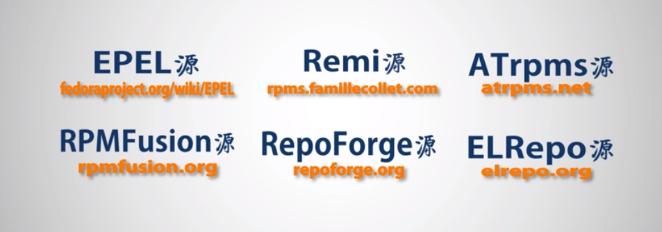

## 八）软件管理

### `wget` 命令

`wget` 用于从网络上的指定链接下载指定内容。w 可能是 web （网络）的首字母缩写。

```bash
wget <url> #下载文件到当前目录下
```


### 使用 `rpm` 管理软件

> 参考：https://man.linuxde.net/rpm

不推荐，因为 rpm 无法解决软件依赖问题。但由于 rpm 是 redhat 官方包管理工具，许多软件安装可能绕不开 rpm，因此有必要学习一下。

-v：显示指令执行过程；

-i：显示套件的相关信息；

-h或--hash：套件安装时列出标记；


### 使用 `yum` 管理软件

yum 全称 yellowdog updater modified （经我直译为：修改版黄狗更新器）。另外，yum 需要根用户权限。

语法

```bash
yum [选项] 命令
```

命令


选项

#### 安装软件

```bash
yum install <软件名>
```

```
yum -y install <软件名>  #表示安装时所有提示默认yes
```

#### 查询软件状态

```
yum list <软件名>
```

yum 支持通配符，所以也许可以这么写

```
yum list soft*
```

查找以 soft 开头的软件

```bash
yum list installed
```

查看已安装的软件

> 如果已安装，将提示“已安装的软件”。如果未安装，将提示“可安装的软件”。如果安装软件不存在 yum 服务器中，将提示“不存在”

#### 查看软件信息

```bash
yum info <软件名>
```

#### 更新软件

```bash
yum update <软件名>
```

#### 移除软件

```bash
yum remove <软件名>
```


#### 设置软件安装源

由于 yum 使用的是 Cent OS 的官方软件源，可能许多必要的软件。所以建议更改为以下建议安装源（截图自《linux系统管理》视频）：



以 repoforge源 为例，设置安装源步骤如下：

下载安装

1. 使用 `wget` 下载软件包
2. 使用 `rpm` 安装该软件包
3. 使用 `cd` 命令进入 `/etc/yum.repo.d` 目录，用 `ls` 可以看到出现了 `rpmforge.repo` 文件

设置优先级

1. 使用 `yum` 安装优先级排序软件 `yum-plugin-priorities`（系统中如果有两个或以上的安装源，系统不知应该优先使用哪个安装源，因此需要使用优先级排序软件）
2. 使用 `vim` 打开 `/etc/yum.repo.d/CentOS-Base.repo` 修改安装源优先级。在三个仓库末尾加入`priority=1` 表示将其优先级设置为最高。
3. 使用 `vim` 打开 `/etc/yum.repo.d/rpmforge.repo` 修改安装源优先级。在三个仓库末尾加入`priority=10` 表示将其优先级设置为低于centos安装源的优先级。

安装其他软件

1. 尝试使用 yum 安装 centos 不存在的安装包，如 `mplayer`（需要安装  `mplayer` 和 `mplayer-gui` 两个包）
2. 使用 gmplayer 就可以打开该播放器